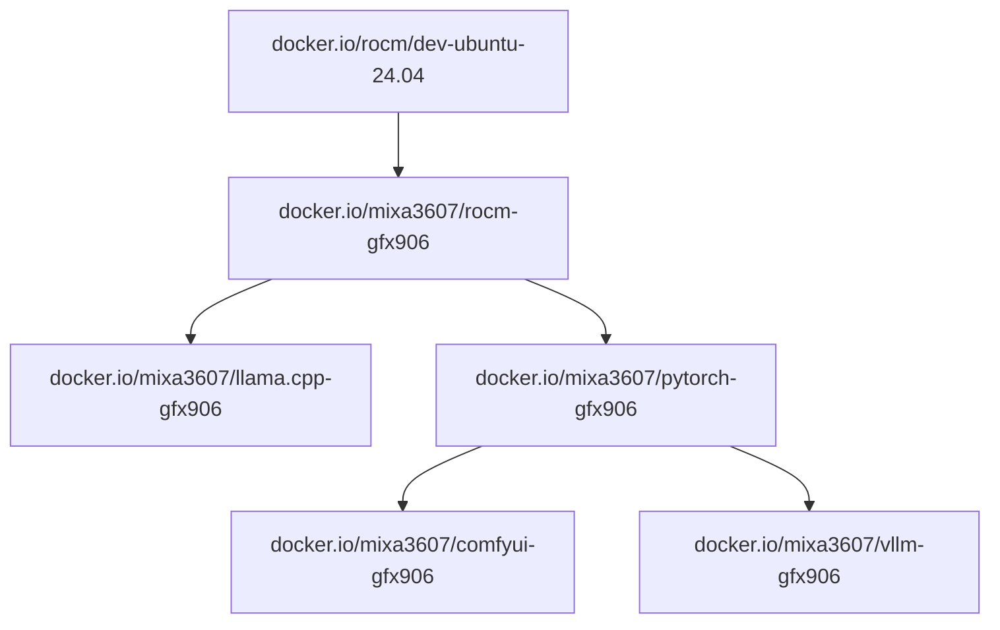

# Homelab GFX906 - MI50 AI Experiment Environment

> **[ 🇨🇳 中文版本 (Chinese Version) ](./readme_zh.md)**

This directory is an extension based on the `gfx906-ml` project, specifically optimized for the **AMD Radeon Instinct MI50 (gfx906)** compute card running on a high-performance workstation.

## 🖥️ Hardware Specification

The scripts and configurations in this repo are tuned for the following setup:

* **Host**: [Lenovo ThinkStation P620](https://psref.lenovo.com/syspool/Sys/PDF/ThinkStation/ThinkStation_P620/ThinkStation_P620_Spec.pdf)
* **CPU**: AMD Ryzen™ Threadripper™ PRO 5945WX (12C/24T)
* **RAM**: 128GB DDR4 RDIMM ECC
* **GPU**: AMD Radeon Instinct MI50 32GB (HBM2)
* **Storage**:
    * **System**: 512GB NVMe SSD
    * **Cache/Data**: 1TB SATA SSD
    * **Archive**: 6TB SAS HDD

## 🚀 Core Features

It integrates the following functionalities:
1.  **LLM Inference & Data Synthesis**: High-performance inference and data rewriting using vLLM and Distilabel.
2.  **Multimodal Generation**: Text-to-Image generation using GLM-Image with environment isolation.
3.  **Model Fine-tuning**: LoRA fine-tuning for large models (e.g., Qwen) using LlamaFactory.
4.  **Cluster Deployment**: Production-ready Kubernetes/K3s manifests for Jupyter & vLLM.

## 📂 Directory Structure

```text
.
├── homelab/            # Local Experiment Notebooks
│   ├── DataGen.ipynb   # [Inference] vLLM deployment & Distilabel data generation
│   ├── Omni.ipynb      # [Image Gen] GLM-Image environment setup (Dependency fix)
│   └── finetune.ipynb  # [Training] LlamaFactory fine-tuning (Optimized for MI50 32G)
└── k8s/                # Kubernetes/K3s Deployment
    ├── Dockerfile      # Custom image with Jupyter, vLLM, and ROCm environment
    └── vllm-finetune-deploy.yaml # Deployment manifest for K8s clusters

```

## 🛠️ Usage Guide

### 1. Local Experiments (`homelab/`)

* **LLM Inference (`DataGen.ipynb`)**: Deploys a local OpenAI-compatible API on MI50 and runs an automated text rewriting pipeline using `Distilabel`. Includes specialized system prompts for content refactoring.
* **Multimodal Painting (`Omni.ipynb`)**: Solves ROCm dependency conflicts (Numpy versions) using a virtualenv (`env_glm`) to successfully run **GLM-Image**. Includes fixes for MI50 black image issues (VAE float32 cast).
* **Model Fine-tuning (`finetune.ipynb`)**: customized **LlamaFactory** training flow for MI50 (32GB VRAM). Forces `fp16` (no bf16 support) and uses specific batch sizes/gradient accumulation for stability.

### 2. Kubernetes / K3s Deployment (`k8s/`)

Deploy your AI environment (Jupyter Lab + vLLM) to a Kubernetes or K3s cluster.

* **Build Image**:
The `k8s/Dockerfile` packages the complete environment, including ROCm dependencies, vLLM, and Jupyter Lab.
```bash
cd k8s
docker build -t your-registry/gfx906-lab:latest .

```


* **Deploy**:
Use the provided manifest to deploy the pod/deployment. This configures the necessary GPU resources and volume mounts.
```bash
kubectl apply -f k8s/vllm-finetune-deploy.yaml

```


*This will spin up a pod providing both a Jupyter interface for development and a vLLM engine for inference services.*

## ⚠️ Known Issues & Notes

1. **No BF16 Support**: The MI50 (Vega 20) does not support hardware `bfloat16`. The config in `finetune.ipynb` is strictly set to `"fp16": True`.
2. **Numpy Conflict**: `Omni.ipynb` uses a specific venv to lock `numpy` to fix Diffusers compatibility.
3. **Memory Management**: It is recommended to run the "Nuke Python" command (provided in notebooks) when switching tasks to avoid VRAM fragmentation.


---


# ML software for deprecated GFX906 arch

## Prebuild images
### Images
| Name | Source | Status | Docs |
| ---- | ------ | ------ | ---- |
| ROCm | [ROCm](https://github.com/ROCm/ROCm), [rocBLAS](https://github.com/ROCm/rocBLAS) | OK | [readme](./rocm/readme.md) |
| PyTorch | [torch](https://github.com/pytorch/pytorch), [vision](https://github.com/pytorch/vision), [audio](https://github.com/pytorch/audio) | OK | [readme](./pytorch/readme.md) |
| llama.cpp | [llama.cpp](https://github.com/ggml-org/llama.cpp) | OK | [readme](./llama.cpp/readme.md) |
| ComfyUI | [ComfyUI](https://github.com/comfyanonymous/ComfyUI) | OK | [readme](./comfyui/readme.md) |
| VLLM | [VLLM](https://github.com/nlzy/vllm-gfx906), [triton](https://github.com/nlzy/triton-gfx906) | OK | [readme](./vllm/readme.md) |


| Project    |    | Image |
| ---------- | -- | ----- |
| ROCm       | ╦═ | `docker.io/mixa3607/rocm-gfx906:7.1.0-complete` |
|            | ╠═ | `docker.io/mixa3607/rocm-gfx906:7.0.2-complete` |
|            | ╠═ | `docker.io/mixa3607/rocm-gfx906:7.0.0-complete` |
|            | ╠═ | `docker.io/mixa3607/rocm-gfx906:6.4.4-complete` |
|            | ╚═ | `docker.io/mixa3607/rocm-gfx906:6.3.3-complete` |
| PyTorch    | ╦═ | `docker.io/mixa3607/pytorch-gfx906:v2.7.1-rocm-6.4.4` |
|            | ╠═ | `docker.io/mixa3607/pytorch-gfx906:v2.7.1-rocm-6.3.3` |
|            | ╠═ | `docker.io/mixa3607/pytorch-gfx906:v2.8.0-rocm-6.4.4` |
|            | ╠═ | `docker.io/mixa3607/pytorch-gfx906:v2.8.0-rocm-6.3.3` |
|            | ╠═ | `docker.io/mixa3607/pytorch-gfx906:v2.9.0-rocm-6.4.4` |
|            | ╠═ | `docker.io/mixa3607/pytorch-gfx906:v2.9.0-rocm-6.3.3` |
|            | ╚═ | `docker.io/mixa3607/pytorch-gfx906:v2.9.0-rocm-7.0.2` |
| ComfyUI    | ╦═ | `docker.io/mixa3607/comfyui-gfx906:v0.3.69-torch-v2.9.0-rocm-7.0.2` |
|            | ╚═ | `docker.io/mixa3607/comfyui-gfx906:v0.3.69-torch-v2.9.0-rocm-6.3.3` |
| vLLM       | ╦═ | `docker.io/mixa3607/vllm-gfx906:0.11.0-rocm-6.3.3` |
|            | ╠═ | `docker.io/mixa3607/vllm-gfx906:0.10.2-rocm-6.3.3` |
|            | ╚═ | `docker.io/mixa3607/vllm-gfx906:0.8.5-rocm-6.3.3`  |
| llama.cpp  | ╦═ | `docker.io/mixa3607/llama.cpp-gfx906:full-b7091-rocm-7.1.0` |
|            | ╚═ | `docker.io/mixa3607/llama.cpp-gfx906:full-b7091-rocm-6.3.3` |


### Deps graph


## Perf tuning
Changing smcPPTable/TdcLimitGfx 350 => 150 reduced the hotspot by 10+- degrees with almost no drop in performance in vllm ([table in vllm](./vllm/readme.md#benchmarks))

```console
$ upp -p /sys/class/drm/card${GPU_ID}/device/pp_table set --write smcPPTable/TdcLimitGfx=150
Changing smcPPTable.TdcLimitGfx of type H from 330 to 150 at 0x1fe
Committing changes to '/sys/class/drm/card1/device/pp_table'.
```


## Environment
[env v1](./docs/setup.v1.md)

## RVS
```shell
apt update && apt install -y rocm-validation-suite
echo 'actions:
- name: gst-581Tflops-4K4K8K-rand-bf16
  device: all
  module: gst
  log_interval: 10000
  ramp_interval: 5000
  duration: 120000
  hot_calls: 1000
  copy_matrix: false
  target_stress: 581000
  matrix_size_a: 4864
  matrix_size_b: 4096
  matrix_size_c: 8192
  matrix_init: rand
  data_type: bf16_r
  lda: 8320
  ldb: 8320
  ldc: 4992
  ldd: 4992
  transa: 1
  transb: 0
  alpha: 1
  beta: 0' > ~/gst-581Tflops-4K4K8K-rand-bf16.conf
/opt/rocm/bin/rvs -c ~/gst-581Tflops-4K4K8K-rand-bf16.conf
```


