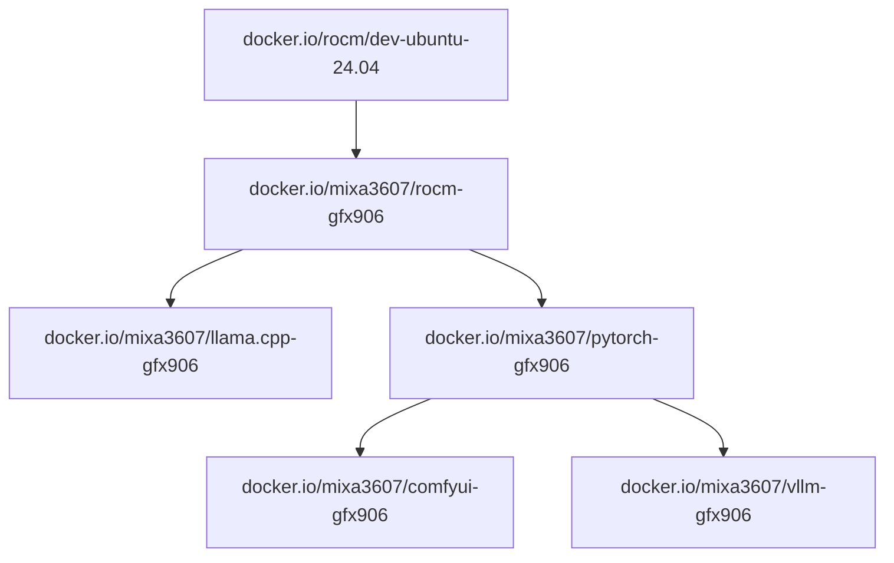

# Homelab GFX906 - MI50 AI Experiment Environment

> **[ 🇨🇳 中文版本 (Chinese Version) ](./README_zh.md)**

This directory (`homelab/`) is an extension based on the `gfx906-ml` project, specifically optimized for the **AMD Radeon Instinct MI50 (gfx906)** compute card.

It integrates the following core functionalities:
1.  **LLM Inference & Data Synthesis**: High-performance inference and data rewriting using vLLM and Distilabel.
2.  **Multimodal Generation**: Text-to-Image generation using GLM-Image with environment isolation.
3.  **Model Fine-tuning**: LoRA fine-tuning for large models (e.g., Qwen) using LlamaFactory.

## 📂 Directory Structure

```text
homelab/
├── DataGen.ipynb   # [Inference] vLLM deployment & Distilabel data generation/rewriting
├── Omni.ipynb      # [Image Gen] GLM-Image environment setup & generation (Dependency fix)
└── finetune.ipynb  # [Training] LlamaFactory fine-tuning (Optimized for MI50 32G)

```

## 🛠️ Script Usage

### 1. LLM Inference & Data Gen (`DataGen.ipynb`)

Demonstrates how to deploy an OpenAI-compatible API locally on MI50 and build an automated pipeline for text processing.

* **Core Components**: `vLLM`, `Distilabel`, `Qwen2.5/Qwen3`
* **Workflow**:
1. **Environment Check**: Auto-detects `vLLM` and ROCm `PyTorch` status.
2. **Service Launch**: Starts a local `vLLM` server via subprocess (GPU util 0.95, Context 8192).
3. **Pipeline Construction**: Connects `Distilabel` to the local API.
4. **Deep Rewrite**: Uses a specialized "Anti-Plagiarism/Refactoring" system prompt to rewrite text.
5. **Output**: Generates `deep_rewritten_results.json`.


> **💡 Note**: After running the service launch cell, wait until you see "Uvicorn running" in the output before proceeding.

### 2. Multimodal Painting (`Omni.ipynb`)

Solves complex dependency conflicts (specifically Numpy versions) in the ROCm environment to successfully run **GLM-Image**.

* **Core Components**: `Diffusers`, `GLM-Image`, `Virtualenv`
* **Key Feature (Isolation)**: Creates a virtual environment `env_glm` and forces `numpy==1.26.4` installation while inheriting system-level ROCm PyTorch (`--system-site-packages`).
* **MI50 Optimization**:
* **Black Image Fix**: Automatically casts VAE/VQModel to `float32` (half-precision VAE decoding fails on MI50).
* **CPU Offload**: Enables model CPU offloading to fit within 32GB VRAM.


* **Usage**: Run the setup cells -> **Restart Kernel** -> Switch to `env_glm` kernel -> Run generation.

### 3. Model Fine-tuning (`finetune.ipynb`)

Efficient LoRA fine-tuning based on LlamaFactory, with a configuration deeply customized for MI50 hardware.

* **Core Components**: `LlamaFactory`, `Deepspeed`
* **Hardware Config (32GB VRAM)**:
* **Flash Attention**: SDPA enabled.
* **Precision**: **Force `fp16**`. (MI50/Vega20 does not support BF16 hardware acceleration).
* **Throughput**: `batch_size=4`, `grad_accum=4` (Effective batch 16), `cutoff_len=4096`.


* **Workflow**: Memory Cleanup -> Data Registration (`evol_instruct_dataset.json`) -> Config Generation -> Training Launch.

## ⚠️ Known Issues & Notes

1. **No BF16 Support**: The MI50 (Vega 20) does not support hardware `bfloat16`. The config in `finetune.ipynb` is strictly set to `"fp16": True`. Using bf16 will result in errors or extremely slow software emulation.
2. **Numpy Conflict**: `Omni.ipynb` uses a specific venv to lock `numpy==1.26.4` to fix Diffusers compatibility without breaking the system PyTorch. Do not upgrade Numpy globally.
3. **Memory Management**: It is recommended to run the "Nuke Python" command (provided in `finetune.ipynb`) or restart the kernel when switching between vLLM, Training, or Image Gen tasks to avoid VRAM fragmentation.

---


# ML software for deprecated GFX906 arch

## Prebuild images
### Images
| Name | Source | Status | Docs |
| ---- | ------ | ------ | ---- |
| ROCm | [ROCm](https://github.com/ROCm/ROCm), [rocBLAS](https://github.com/ROCm/rocBLAS) | OK | [readme](./rocm/readme.md) |
| PyTorch | [torch](https://github.com/pytorch/pytorch), [vision](https://github.com/pytorch/vision), [audio](https://github.com/pytorch/audio) | OK | [readme](./pytorch/readme.md) |
| llama.cpp | [llama.cpp](https://github.com/ggml-org/llama.cpp) | OK | [readme](./llama.cpp/readme.md) |
| ComfyUI | [ComfyUI](https://github.com/comfyanonymous/ComfyUI) | OK | [readme](./comfyui/readme.md) |
| VLLM | [VLLM](https://github.com/nlzy/vllm-gfx906), [triton](https://github.com/nlzy/triton-gfx906) | OK | [readme](./vllm/readme.md) |


| Project    |    | Image |
| ---------- | -- | ----- |
| ROCm       | ╦═ | `docker.io/mixa3607/rocm-gfx906:7.1.0-complete` |
|            | ╠═ | `docker.io/mixa3607/rocm-gfx906:7.0.2-complete` |
|            | ╠═ | `docker.io/mixa3607/rocm-gfx906:7.0.0-complete` |
|            | ╠═ | `docker.io/mixa3607/rocm-gfx906:6.4.4-complete` |
|            | ╚═ | `docker.io/mixa3607/rocm-gfx906:6.3.3-complete` |
| PyTorch    | ╦═ | `docker.io/mixa3607/pytorch-gfx906:v2.7.1-rocm-6.4.4` |
|            | ╠═ | `docker.io/mixa3607/pytorch-gfx906:v2.7.1-rocm-6.3.3` |
|            | ╠═ | `docker.io/mixa3607/pytorch-gfx906:v2.8.0-rocm-6.4.4` |
|            | ╠═ | `docker.io/mixa3607/pytorch-gfx906:v2.8.0-rocm-6.3.3` |
|            | ╠═ | `docker.io/mixa3607/pytorch-gfx906:v2.9.0-rocm-6.4.4` |
|            | ╠═ | `docker.io/mixa3607/pytorch-gfx906:v2.9.0-rocm-6.3.3` |
|            | ╚═ | `docker.io/mixa3607/pytorch-gfx906:v2.9.0-rocm-7.0.2` |
| ComfyUI    | ╦═ | `docker.io/mixa3607/comfyui-gfx906:v0.3.69-torch-v2.9.0-rocm-7.0.2` |
|            | ╚═ | `docker.io/mixa3607/comfyui-gfx906:v0.3.69-torch-v2.9.0-rocm-6.3.3` |
| vLLM       | ╦═ | `docker.io/mixa3607/vllm-gfx906:0.11.0-rocm-6.3.3` |
|            | ╠═ | `docker.io/mixa3607/vllm-gfx906:0.10.2-rocm-6.3.3` |
|            | ╚═ | `docker.io/mixa3607/vllm-gfx906:0.8.5-rocm-6.3.3`  |
| llama.cpp  | ╦═ | `docker.io/mixa3607/llama.cpp-gfx906:full-b7091-rocm-7.1.0` |
|            | ╚═ | `docker.io/mixa3607/llama.cpp-gfx906:full-b7091-rocm-6.3.3` |


### Deps graph


## Perf tuning
Changing smcPPTable/TdcLimitGfx 350 => 150 reduced the hotspot by 10+- degrees with almost no drop in performance in vllm ([table in vllm](./vllm/readme.md#benchmarks))

```console
$ upp -p /sys/class/drm/card${GPU_ID}/device/pp_table set --write smcPPTable/TdcLimitGfx=150
Changing smcPPTable.TdcLimitGfx of type H from 330 to 150 at 0x1fe
Committing changes to '/sys/class/drm/card1/device/pp_table'.
```


## Environment
[env v1](./docs/setup.v1.md)

## RVS
```shell
apt update && apt install -y rocm-validation-suite
echo 'actions:
- name: gst-581Tflops-4K4K8K-rand-bf16
  device: all
  module: gst
  log_interval: 10000
  ramp_interval: 5000
  duration: 120000
  hot_calls: 1000
  copy_matrix: false
  target_stress: 581000
  matrix_size_a: 4864
  matrix_size_b: 4096
  matrix_size_c: 8192
  matrix_init: rand
  data_type: bf16_r
  lda: 8320
  ldb: 8320
  ldc: 4992
  ldd: 4992
  transa: 1
  transb: 0
  alpha: 1
  beta: 0' > ~/gst-581Tflops-4K4K8K-rand-bf16.conf
/opt/rocm/bin/rvs -c ~/gst-581Tflops-4K4K8K-rand-bf16.conf
```


